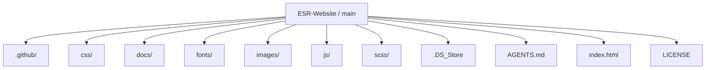
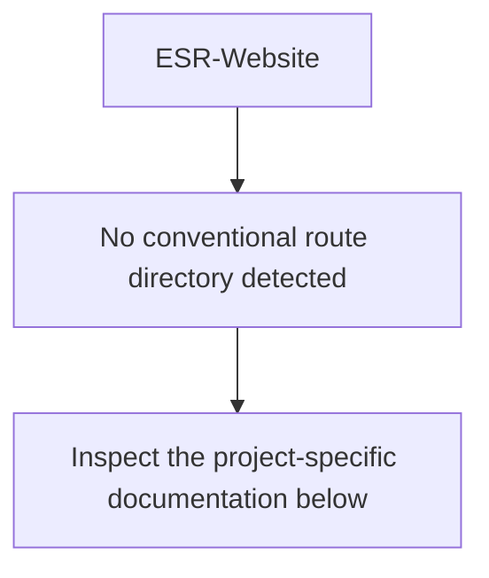
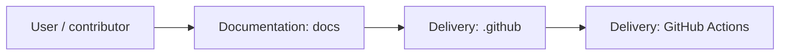
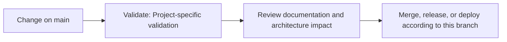

<div align="center">

# 🏢 ESR Website

<!-- interactive-readme-standard:start -->

> [!NOTE]
> **Branch-specific documentation:** this section is maintained for [`main`](https://github.com/Nischhalsubba/ESR-Website/tree/main). It is generated from the files present on this branch and preserves the project-authored README below.

<details open>
<summary><strong>Interactive repository guide</strong></summary>

## Branch overview

| Item | Value |
|---|---|
| Repository | [`Nischhalsubba/ESR-Website`](https://github.com/Nischhalsubba/ESR-Website) |
| Branch | [`main`](https://github.com/Nischhalsubba/ESR-Website/tree/main) |
| Detected stack | Sass, CSS, JavaScript, HTML |
| Detected manifests | No standard manifest detected |
| Documentation policy | Every maintained branch must explain purpose, setup, structure, architecture, flows, testing, delivery, security, and ownership. |

## Repository structure



The diagram is generated from the branch's actual top-level files and directories. Use the branch link above for complete source navigation.

## Website or application structure



## Application and responsibility flow



## Change-to-delivery flow



## README requirements for this branch

- Explain what this branch contains and how it differs from the default branch.
- Keep installation, configuration, usage, testing, deployment, security, support, and license information accurate.
- Document repository, website or application, API, data, authentication, background-job, and deployment flows when they exist.
- Prefer Mermaid diagrams and expandable `<details>` sections for visual navigation.
- Link diagrams and modules to real source paths; never invent missing components.
- Preserve project-specific documentation and update diagrams whenever architecture or major paths change.
- Treat secrets, private infrastructure, customer data, and credentials as prohibited README content.

</details>

<!-- interactive-readme-standard:end -->

### Static Corporate Technology Agency Landing Page

**A responsive ESR Tech corporate website built with HTML, CSS, JavaScript, Bootstrap, Swiper, lightbox/gallery filtering, Material Design Icons, newsletter CTA, team section, projects section, and smooth one-page navigation.**


</div>

---

## ✨ Overview

**ESR Website** is a static corporate landing page for ESR Tech or a similar technology/service organization. The page introduces the company, explains services, showcases projects, presents team members, includes newsletter/contact CTAs, and uses JavaScript-driven interactions such as filtering, lightbox preview, scroll navigation, and back-to-top behavior.

The project is built with classic static web technologies and can be hosted on any static hosting platform.

---

## 🧭 Table of Contents

- [Project Purpose](#-project-purpose)
- [Designer’s Perspective](#-designers-perspective)
- [Page Sections](#-page-sections)
- [Features](#-features)
- [Tech Stack](#-tech-stack)
- [Repository Structure](#-repository-structure)
- [Run Locally](#-run-locally)
- [Deployment](#-deployment)
- [Content Notes](#-content-notes)
- [Quality Checklist](#-quality-checklist)
- [Roadmap](#-roadmap)
- [License](#-license)

---

## 🎯 Project Purpose

The purpose of this repository is to provide a static corporate website for a technology company.

The page helps visitors understand:

- what the company does
- what services are offered
- what projects or work categories exist
- who is on the team
- how to get in touch
- how to subscribe to updates

---

## 🎨 Designer’s Perspective

This website follows a clean agency/corporate landing page pattern.

The key design goals are:

- make the company value proposition visible in the hero
- keep navigation simple and section-based
- make service blocks easy to scan
- make project filtering feel interactive
- keep the team section friendly and credible
- use CTAs to guide contact or newsletter actions
- maintain responsive readability across screen sizes

The project is a good example of a static company website where structure matters more than heavy application logic.

---

## 🧱 Page Sections

| Section | ID / Area | Purpose |
|---|---|---|
| Navbar | `#navbar-sticky` | Fixed responsive navigation |
| Hero | `#home` | Main company value proposition and CTA |
| Services/About | `#about` | “What we provide” service cards |
| Projects | `#projects` | Filterable project grid/gallery |
| Team | `#team` | Team member presentation |
| Newsletter CTA | Footer CTA | Email subscription prompt |
| Footer | Footer links | Contact details and resource links |
| Back to Top | `#back-to-top` | Quick scroll return action |

---

## 🌟 Features

| Feature | Description |
|---|---|
| Fixed navbar | Scroll-aware Bootstrap navigation |
| Hero CTA | Strong headline, supporting text, and proposal CTA |
| Services section | Web/mobile development, developers on-demand, other services |
| Filterable projects | Category filters powered by JS |
| Lightbox-ready gallery | Project images use lightbox/gallery data attributes |
| Swiper support | Swiper assets included for carousel-ready sections |
| Team section | Four-column team profile layout |
| Newsletter CTA | Email input and CTA block |
| Back-to-top button | JavaScript scroll helper |
| Responsive grid | Bootstrap layout across common screen sizes |

---

## 🛠 Tech Stack

| Layer | Technology | Purpose |
|---|---|---|
| Markup | HTML5 | Static structure |
| Styling | CSS / SCSS-style assets | Visual system and custom layout |
| Framework | Bootstrap | Responsive layout and components |
| Icons | Material Design Icons | UI iconography |
| Slider | Swiper | Carousel/slider support |
| Lightbox | MK Lightbox / `mklb` | Project image preview behavior |
| JavaScript | Vanilla JS + plugin files | Filtering, counters, scroll, app behavior |

---

## 📁 Repository Structure

```text
.
├── index.html
├── css/
│   ├── bootstrap.min.css
│   ├── style.css
│   ├── mklb.css
│   ├── swiper-bundle.min.css
│   └── materialdesignicons.min.css
├── js/
│   ├── bootstrap.bundle.min.js
│   ├── filter.init.js
│   ├── mklb.js
│   ├── swiper-bundle.min.js
│   ├── swiper.js
│   ├── counter.init.js
│   └── app.js
├── images/
│   ├── favicon.png
│   ├── heros/
│   └── agency/
└── README.md
```

---

## 🚀 Run Locally

No build step is required.

### Option 1: Open directly

Open `index.html` in your browser.

### Option 2: Use a local static server

```bash
python -m http.server 8000
```

Then open:

```text
http://127.0.0.1:8000/
```

---

## 🌐 Deployment

Deploy the project to any static hosting service:

- GitHub Pages
- Netlify
- Vercel
- Cloudflare Pages
- shared hosting / cPanel

Make sure the folder structure stays intact so all CSS, JS, and image paths work.

---

## 📝 Content Notes

The current page contains some placeholder/demo copy and sample team/project content. Before production use, review and update:

- hero headline and subcopy
- services descriptions
- project images and titles
- team member names and roles
- newsletter text
- contact email and phone
- footer links
- placeholder `javascript:void(0)` links
- external logo/image URLs

---

## ✅ Quality Checklist

### Design QA

- [ ] Hero headline is clear and not generic.
- [ ] CTA buttons are visible.
- [ ] Services section is scannable.
- [ ] Project filters are easy to understand.
- [ ] Team cards look consistent.
- [ ] Footer CTA is readable on mobile.
- [ ] Logo has correct contrast in navbar/footer.

### Technical QA

- [ ] `index.html` loads without errors.
- [ ] Bootstrap JS works.
- [ ] Project filtering works.
- [ ] Lightbox/gallery works.
- [ ] Swiper sections work if used.
- [ ] Back-to-top button works.
- [ ] All local assets load correctly.
- [ ] External assets are replaced or stable.

### Accessibility QA

- [ ] Navbar toggle has accessible behavior.
- [ ] Images have meaningful alt text.
- [ ] Buttons and links are keyboard reachable.
- [ ] Forms have labels or accessible names.
- [ ] Color contrast is checked.

---

## 🗺 Roadmap

- Replace placeholder team/project content.
- Add service detail pages.
- Add contact form backend.
- Add SEO metadata and Open Graph tags.
- Add sitemap and robots file.
- Optimize and self-host remote images/logos.
- Improve accessibility labels.
- Add real project case-study pages.

---

## 📜 License

This project is licensed under the **MIT License**. See the `LICENSE` file for more information.

---

<div align="center">

A static corporate website foundation for technology-service storytelling.

</div>
