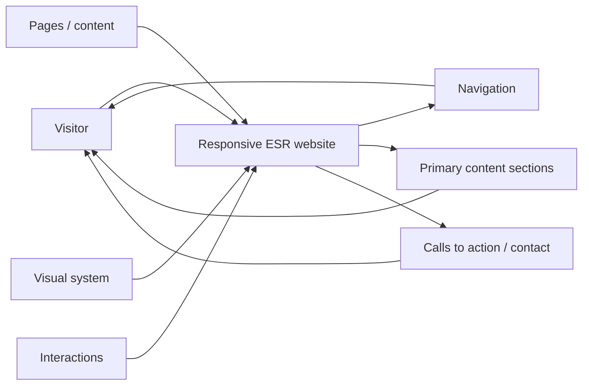
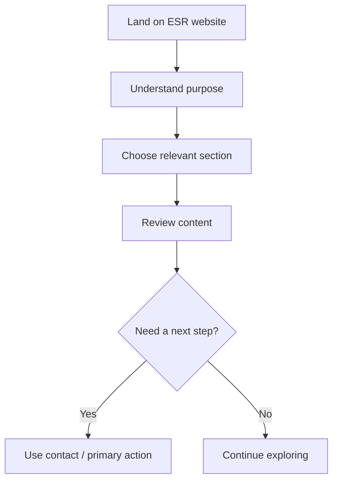
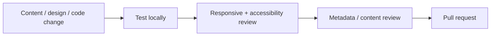

<div align="center">

# ESR Website

**The ESR web project, documented as a clear public-facing website with an understandable architecture, user flow, design guidance, and discoverability checklist.**


[Browse source](https://github.com/Nischhalsubba/ESR-Website/tree/main) · [Issues](https://github.com/Nischhalsubba/ESR-Website/issues)

</div>

## Overview

**ESR Website** is documented for people who need different levels of detail: visitors should understand the experience, designers should see the information and interaction model, and developers should see how presentation, behavior, content, and delivery fit together.

<details open>
<summary><strong>🏗️ Interactive website architecture</strong></summary>



</details>

## User flow



## Audience guide

| Audience | Review |
|---|---|
| Developers | Source structure, behavior, assets, build/deployment files |
| Designers | Hierarchy, responsive layout, interaction states, accessibility |
| Content owners | Page goals, copy accuracy, links, metadata |
| Stakeholders | User journey, key sections, calls to action |

## Getting started

```bash
git clone https://github.com/Nischhalsubba/ESR-Website.git
cd ESR-Website
```

Use the runtime and package manager declared by the repository's manifests and lockfiles. Do not add setup commands that the project itself does not support.

## Design & accessibility

Keep navigation predictable, content scannable, focus visible, touch targets usable, contrast readable, imagery meaningful, and layouts resilient across narrow and wide screens.

## SEO & discoverability

Public pages should have unique titles and descriptions, semantic headings, descriptive internal links, meaningful image alternatives, canonical URLs, social-preview metadata, and indexable text that accurately explains ESR and the purpose of each page. Add sitemap/robots support when the deployed structure requires it.

## Contribution flow


