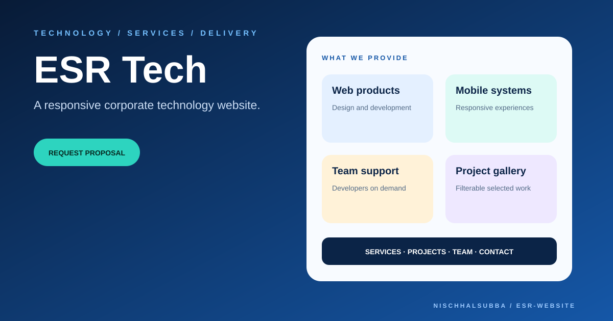

# ESR Website Repository Overview

## Classification

Static technology-company landing page using HTML, CSS, Bootstrap, vanilla JavaScript, Swiper, and lightbox/filter plugins.

- Main areas: hero, services, filterable projects, team, newsletter, footer
- Build step: none required
- Deployment: not verified during this pass
- Fresh screenshot: not captured because public hosts were unreachable
- Visual above: local presentation thumbnail, not a browser screenshot

## Highest-priority checks

1. Replace placeholder company, project, team, and contact content.
2. Verify filters, lightbox, navbar, Swiper, and back-to-top behavior.
3. Remove dead `javascript:void(0)` links.
4. Add unique metadata, Open Graph, sitemap, and robots policy.
5. Verify form labels, keyboard navigation, contrast, and asset licensing.